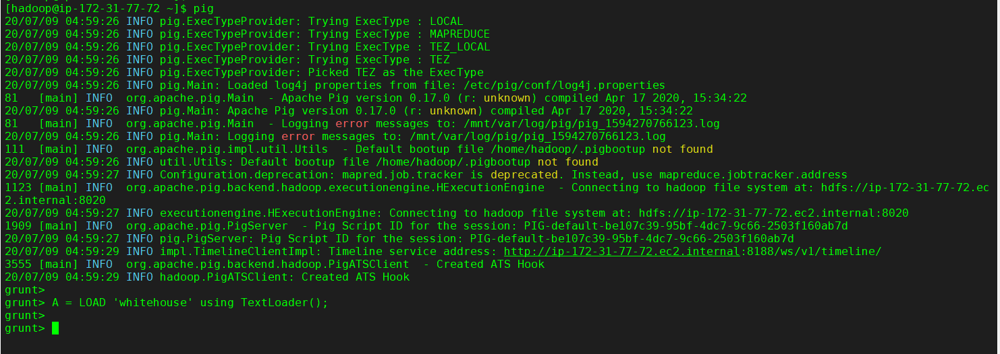
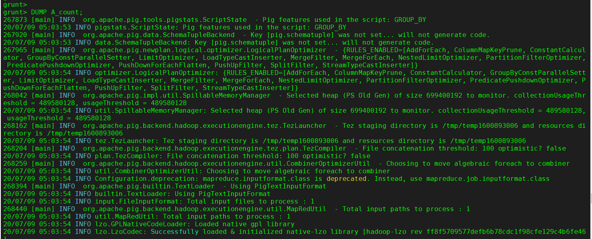
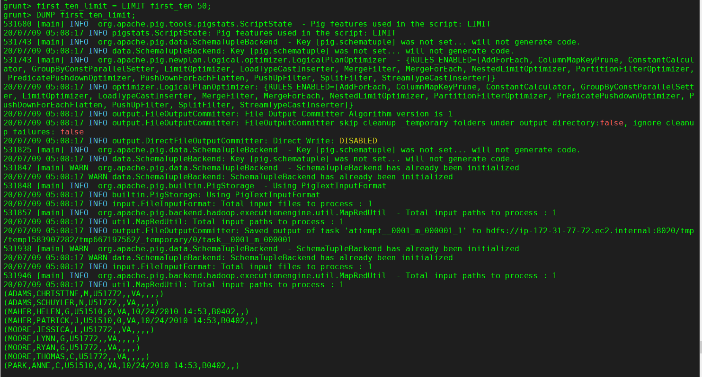
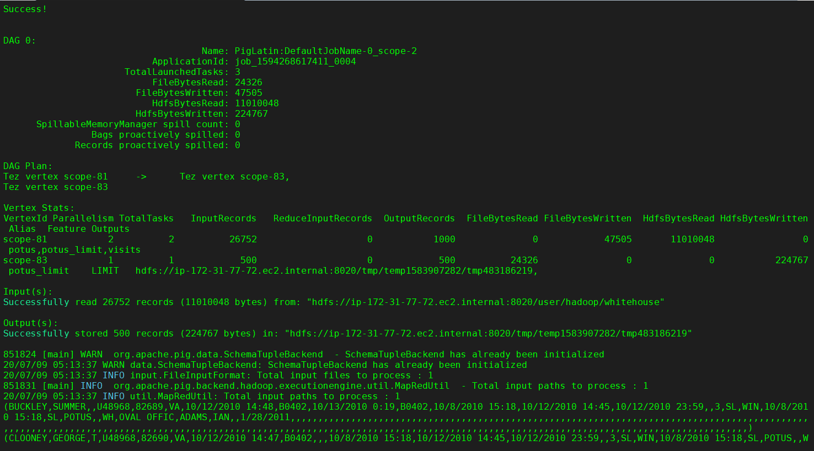
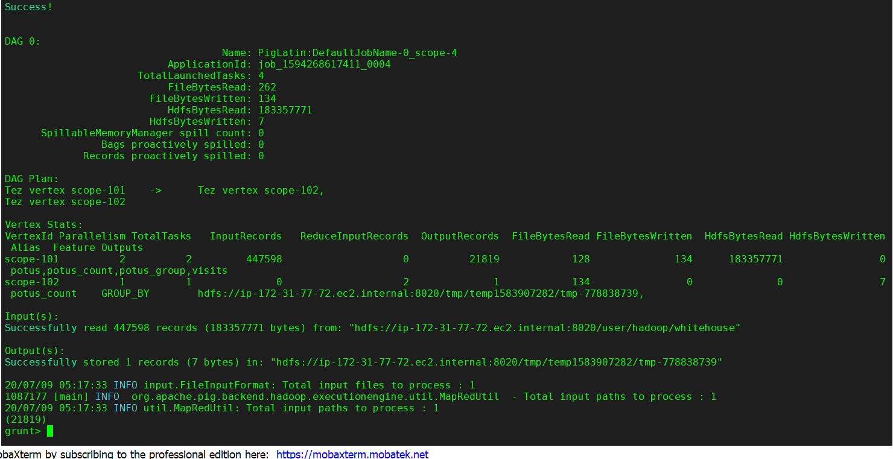
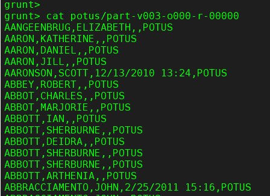

# LAB -> Getting Started with Pig

***Objective -> UUse Pig to navigate through HDFS and explore a dataset.***

***Pre-requisites -> At a minimum, complete steps 1 and 2 of the [Getting Started with Pig](getting_started.md) lab.***

Following are the steps to be performed in this lab:-

1. Load the White House Visitor Data
   1. SSH to your EMR cluster
   2. You will use the TextLoader to load the visits.txt file. From the Pig Grunt shell, define the following LOAD relation:

    

2. Count the Number of Lines
   1. Define a new relation named B that is a group of all the records in A:

    

   2. Use DESCRIBE to view the schema of B.

    

    What is the datatype of the group field? ***Answer:*** Chararray

   3. The A field of the B tuple is a bag of all of the records in visits.txt. Use the COUNT function on this bag to determine how many lines of text are in visits.txt:

    

    *Note: The ‘rowcount’ string in the FOREACH statement is simply to demonstrate that you can have constant values in a GENERATE clause. It is certainly not necessary; it just makes the output nicer to read.*

   4. Use DUMP on A_count to view the result. The output should look like:

    

    

    We can now conclude that there are 447,598 rows of text in visits.txt.

3. Analyze the Data’s Contents
    1. We now know how many records are in the data, but we still do not have a clear picture of what the records look like. Let’s start by looking at the fields of each record. Load the data using PigStorage(‘,’) instead of TextLoader():

    

    This will split up the fields by comma.

    2. Use a FOREACH...GENERATE command to define a relation that is a projection of the first 10 fields of the visits relation.

    

    3. Use LIMIT to display only 50 records then DUMP the result. The output should be 50 tuples that represent the first 10 fields of visits:

    

    ***Note: Because LIMIT uses an arbitrary sample of the data, your output will be different names but the format should look similar. Notice from the output that the first three fields are the person’s name. The next seven fields are a unique ID, badge number, access type, time of arrival, post of arrival, time of departure, and post of departure.***

4. Locate the POTUS (President of the United States of America)
   1. There are 26 fields in each record, and one of them represents the visitee (the person being visited in the White House). Your goal now is to locate this column and determine who has visited the President of the United States. Define a relation that is a projection of the last seven fields ($19 to $25) of visits. Use LIMIT to only output 500 records. The output should look like:

    

    This will split up the fields by comma.

    2. It is not necessarily obvious from the output, but field $19 in the visits relation represents the visitee. Even though you selected 500 records in the previous step, you may or may not see POTUS in the output above. (The White House has thousands of visitors each day, but only a few meet the President.)

    3. Use FILTER to define a relation that only contains records of visits where field $19 matches POTUS. Limit the output to 500 records. The output should include only visitors who met with the President. For example:

    

    

5. Count the POTUS Visitors
   1. Let’s discover how many people have visited the President. To do this, we need to count the number of records in visits where field $19 matches POTUS. See if you can write a Pig script to accomplish this. Use the potus relation from the previous step as a starting point. You will need to use GROUP ALL and then a FOREACH projection that uses the COUNT function. 
   
   If successful, you should get 21,819 as the number of visitors to the White House who visited the President.

   2. Solution:

    

    

6. Finding People Who Visited the President
   1. So far you have used DUMP to view the results of your Pig scripts. In this step, you will save the output to a file using the STORE command.
   2. Now FILTER the relation by visitors who met with the President:

    

   3. Define a projection of the potus relationship that contains the name and time of arrival of the visitor:

    

   4. Order the potus_details projection by last name:

    

   5. Store the records of potus_details_ordered into a folder named potus and using a comma delimiter:

    

    

   6. View the contents of the potus folder:

    

   7. Notice that there is a single output file, so the Pig job was executed with one reducer. View the contents of the output file using cat. The output should be in a comma‐delimited format and should contain the last name, first name, time of arrival (if available), and the string POTUS:

    

    

***Result -> You have written several Pig scripts to analyze and query the data in the White House  visitors’ log. You should now be comfortable with writing Pig scripts with the Grunt shell and using common Pig commands like LOAD, GROUP, FOREACH, FILTER, LIMIT, DUMP, and STORE.***
