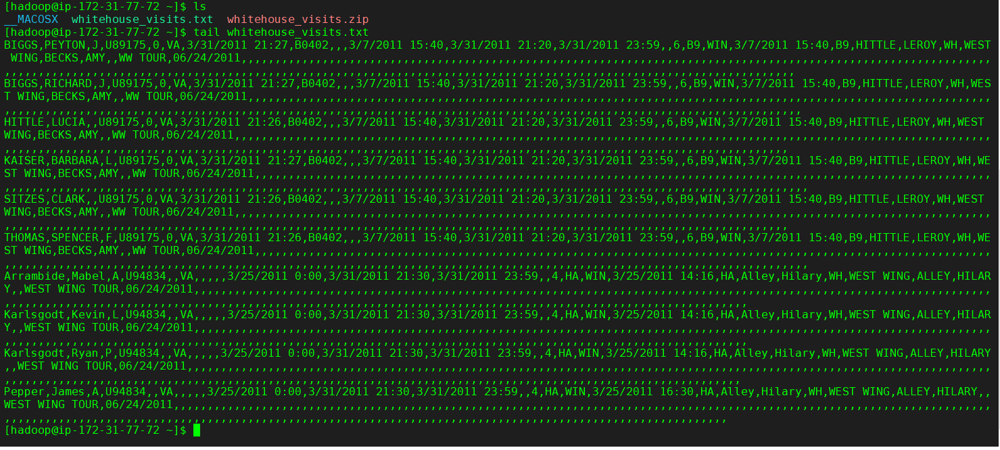
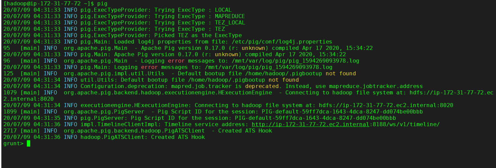
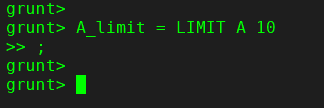
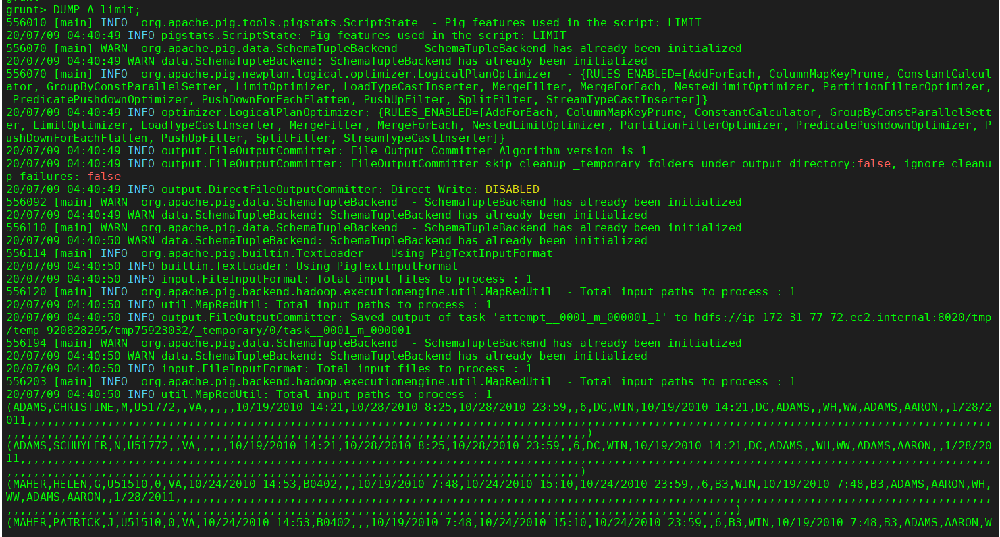
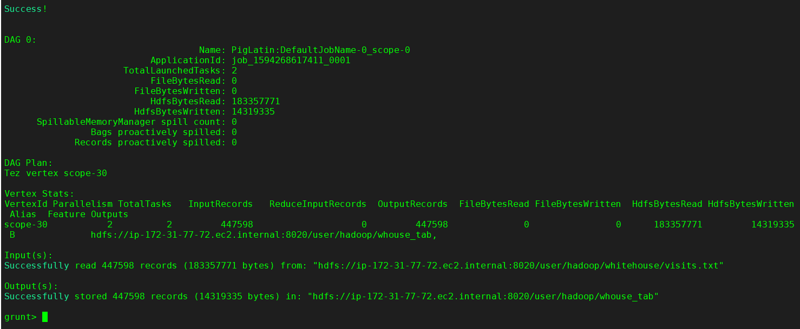
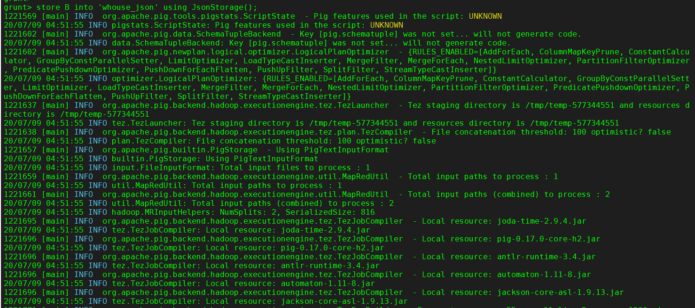

# LAB -> Getting Started with Pig

***Objective -> Use Pig to navigate through HDFS and explore a dataset.***

***Pre-requisites -> Hadoop cluster on EMR should be up and running***

Following are the steps to be performed in this lab:-

1. View Raw Data
   1. SSH to your EMR cluster
   2. Unzip whitehouse_visits.zip

    

   3. View contents of this file

    

   4. Load data into HDFS
      1. Start grunt shell

        

      2. Create new directory named whitehouse

        

      3. Copy whitehouse_visits.txt file to this directory

        

      4. Use ls command to verify whether file was successfully uplaoded

        

    5. Define a Relation
       1. Use TextLoader to load visits.txt file. Define a LOAD relation 

        

       2. Use 'Describe A'. You will notice that there is no schema present in A

        

       3. Use LIMIT operator to define a new relation named A_limit that is limited to 10 records of A

        

       4. Use DUMP operator to view A_limit relation

        

    5. Define a Schema
       1. Load whitehouse data again, but this time we use PigStorage loader and define a partial schema 

        

       2. Use 'Describe B' to view the schema

        

        

       2. Verify that whouse_tab folder was created. You should see 2 mapped output files.

        

       3. View one of the output files to veriy they contain the B relation in a tab-delimited format

        

       4. Each record should contain seven fields. What happened to the rest of the fields from the raw data that was loaded from whitehouse/visits.txt?

            ***Answer***: They were simply ignored when each record was read in from HDFS.

    7. Use a different Storer
       1. In the previous step, you stored a relation using PigStorage with a tab delimiter. Enter the following command, which stores the same relation but in a JSON format: 

        

        

       2. Verify that whouse_json folder was created

        

       3. View one of the output files

        

***Result -> You have now seen how to execute some basic Pig commands, load data into a relation, and store a relation into a folder in HDFS using different formats.***
